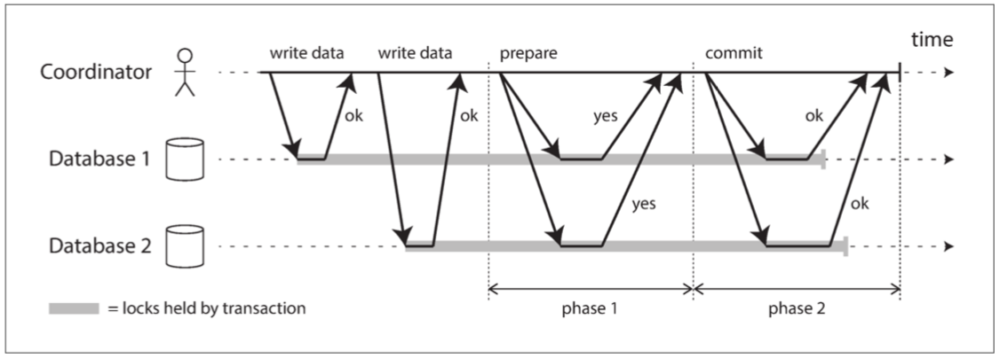

# DDIA page 351

## Distrubited Transactions and Consesus

Consesus: get several nodes to agree on something

* Leader election
* Atomic commit

### Atomic commit and 2PC

Goal: Commit or roll back

#### Single node to distributed atomic commit

Single node atomicity is implemented by the storage engine. The moment at whitch the disk finishes writing the commit record is the key. After it, the transaction is committed

For mutiples notes, it is not enough to ask every node do the atomic commit

#### 2PC

All nodes writes are durable or roll back

#### coordinator crashes

When it recovers, read decision from disk and send it to replicas.

Algrithom blocked if coordinator crashes after prepare, but before broadcasting decision, other nodes do not know how it has decided

